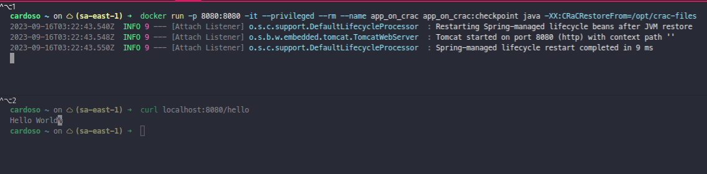

= Rodando com CRaC

== Comandos

- Na raiz do projeto: `docker build -t app_on_crac .`
- Executar o container com privilégios: `docker run -it --privileged --rm --name app_on_crac app_on_crac`
- Executar a aplicação no container: `java -XX:CRaCCheckpointTo=/opt/crac-files -jar /opt/app/poc-crac-0.0.1-SNAPSHOT.jar`
- Anotar o PID que aparece na primeira linha de execução: `Starting PocCracApplication v0.0.1-SNAPSHOT using Java 17-crac with PID 9 (/opt/app/poc-crac-0.0.1-SNAPSHOT.jar started by root in /)`
- Em outro terminal, executar o comando: `docker exec -it -u root app_on_crac /bin/bash`
- Nesse terminal, estimular a aplicação executando o seguinte `curl`: `curl localhost:8080/hello`
- Executar o comando para gerar o checkpoint, onde <PID> corresponde ao PID anotado anteriormente: `jcmd <PID> JDK.checkpoint`
- O segundo container pode ser finalizado com o comando `exit`. Ainda no segundo terminal, executar o comando `docker ps -a` e anotar o CONTAINER ID do `app_on_crac`
- Executar então o comando `docker commit <CONTAINER ID> app_on_crac:checkpoint` onde <CONTAINER ID> é o id anotado do passo anterior.
- Agora sim, o segundo terminal pode ser finalizado e o primeiro container também, com o comando `exit`
- Agora para rodar novamente a partir do checkpoint: `docker run -p 8080:8080 -it --privileged --rm --name app_on_crac app_on_crac:checkpoint java -XX:CRaCRestoreFrom=/opt/crac-files`
- A aplicação pode ser acessada normalmente agora a partir da porta 8080: `curl localhost:8080/hello`

Inicialização da aplicação em 9ms e chamada do endpoint da aplicação para demonstrar o funcionamento.

*O suporte para o CRaC com o Spring só está disponível a partir da versão 6.1.x do Spring Framework*

=== Links

- https://docs.spring.io/spring-framework/reference/6.1/integration/checkpoint-restore.html
- https://github.com/CRaC/openjdk-builds